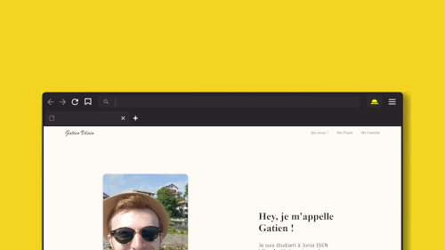

# Site web de Gatien VILAIN

Ce dépot contient les fichiers utilisés pour générer mon [site web](https://gatienvilain.github.io/)

Ce site internet a pour but de faire une présentation de [moi-même](https://www.linkedin.com/in/gatien-vilain/) et des [projets](https://github.com/GatienVilain?tab=repositories) auquel j'ai pu participer.

# Contribuer au site web

Si vous souhaitez apporter des modification à une page, vous pouver les proposer via un pull request. Si vous voulez savoir comment faire voici un [article intéressant](https://codeur-pro.fr/contribuer-a-un-projet-open-source-sur-github/)

# Un problèmes ?
Si vous rencontrez des problèmes à l'utilisation, veuillez ouvrir un billet sous la rubrique [issues](https://github.com/GatienVilain/GatienVilain.github.io/issues). Bien que ce projet ne soit plus actif, nous essayerons d'y jeter un coup d'oeil.

# Licence

 Ce travail est sous licence <a rel="license" href="http://creativecommons.org/licenses/by-nc/4.0/">Creative Commons Attribution-NonCommercial 4.0 International</a>.

